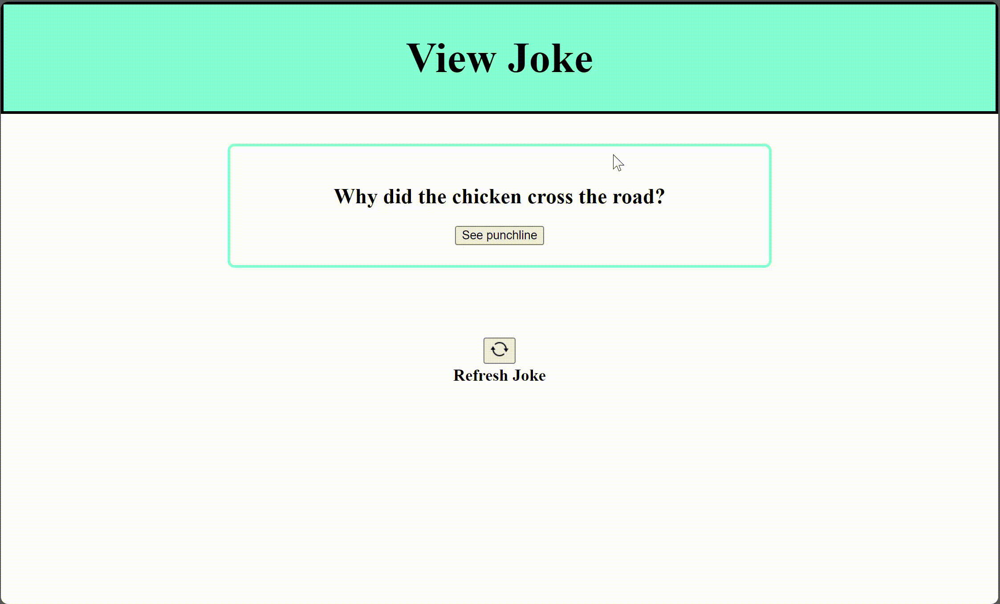
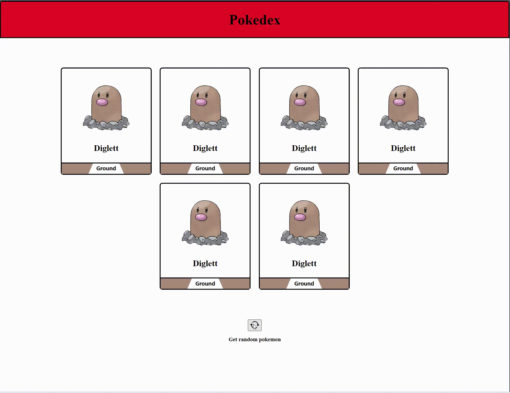
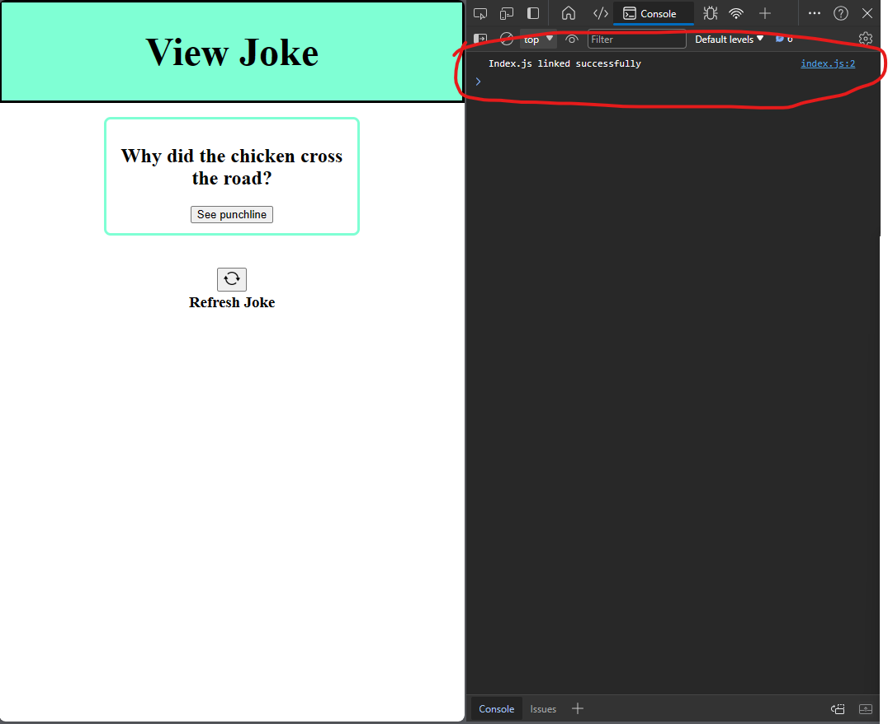

# Intro to Fetch & APIs

## Assignment:  JokeView + Pokedex

#### Overview
In this assignment, you will configure two different webpages to request data from an api. You will use the response data from the API to update the page with new information.

<div style="display: flex; flex-direction: column; justify-content: center;  align-items: center;
">  <div>
    <h1 style="margin-right: 1%; margin-top: 1%; text-align:center; margin-bottom: 0px;" >Part 1: JokeView</h1>
   <h3 style="text-align: center; margin-top: 0px;">API Endpoint: <a href="https://official-joke-api.appspot.com/random_joke">https://official-joke-api.appspot.com/random_joke</a></h3>

    
   <h1 style="margin-right: 1%; margin-top: 1%; text-align:center" >Part 2: PokeDex</h1>
   <h3 style="text-align: center; margin-top: 0px;">API Endpoint: <a href="https://pokeapi-ptvv.onrender.com/pokemon/team">https://pokeapi-ptvv.onrender.com/pokemon/team</a></h3>
   
  </div>
</div>


### Instructions

DO NOT USE ANY INLINE JAVASCRIPT FOR THIS ASSIGNMENT. ALL JAVASCRIPT MUST BE WRITTEN IN EXTERNAL JAVASCRIPT FILES

### **Part 1: JokeView**

<details>

<summary>Preview</summary>


</details>

<br>


1. Link [the javascript file](Part1/index.js) to [the html file](Part1/index.html)

   - Place a [script tag](https://developer.mozilla.org/en-US/docs/Web/HTML/Element/script#basic_usage) at the bottom of the [the html file](Part1/index.html) just before the closing [html tag](https://www.w3schools.com/tags/tag_html.asp).
   
   <br/>
   
   - Configure the script tag to link to [the javascript file](Part1/index.js) by setting the [src attribute](https://www.w3schools.com/TAGS/att_script_src.asp) of the script tag 

   <br/>

   - Verify the javascript file was linked properly
         <details>

      <summary> Add a console log statement to top of the javascript file that logs "Index.js linked successfully" to the console</summary>

      
      </details>

   <br/>


2. When a user clicks the "See punchline" button, unhide the punchline\
   <br/>
   - The punchline of each joke is configured to be hidden by default by setting its [visibility css attritbute](https://www.w3schools.com/cssref/pr_class_visibility.php) to [hidden](https://developer.mozilla.org/en-US/docs/Web/CSS/visibility#hidden) in [the CSS file](Part1/index.css), configure to the
   button to set the visibility CSS attribute to [visible](https://developer.mozilla.org/en-US/docs/Web/CSS/visibility#visible) when clicked (DO NOT MODIFY [THE CSS FILE](Part1/index.css))

<br/>

3. When a user clicks the "Refresh Joke" button, fetch a random joke from the Jokes API and replace the current joke on the page with a new joke 

   <br>

      <details>

      <summary>Configure the Refresh button to print "Refreshing joke..." to the console when clicked</summary>
      <br>
      
      </details>

   <br>

      <details>

      <summary>Configure the Refresh button's onclick event to send an <a href="https://www.w3schools.com/whatis/whatis_http.asp">HTTP request</a> to the JokeAPI's <a href="https://official-joke-api.appspot.com/random_joke">Random Joke endpoint</a> and console log the response data</summary>
      <br>
      
      </details>
 
      <br>
      
      - Use the fetch function to send an HTTP GET request to this url: https://official-joke-api.appspot.com/random_joke

      <br>
      
      - <details>

         <summary>Verify the request is being sent successfully by looking at the Network tab in developer tool</summary>
         <br>
         
         </details>

         - [How to open network tab in Chrome](https://youtube.com/clip/UgkxU0_u8PNntYBV-U6D3pJDneMmrQ1w2Fy4?si=uY0cCgQXe71XYinq)

      <br>

      - <details>

         <summary>Verify the response data for each request is a json object with 4 properties of "type", "setup", "punchline", and "id" </summary>
         <br>
         
         </details>
      
         <br/>
      - <details>

         <summary> Configure the Refresh button's onclick event to print the the response data for each request to the console</summary>
         <br>
         

         </details>
         <br>

         
         - <details>

            <summary> Create a <a href="https://developer.mozilla.org/en-US/docs/Learn/JavaScript/Asynchronous/Promises#chaining_promises">promise chain</a> on the fetch request to the Jokes API that:
            
            <br/>
            
            1. Converts the response data from a json string to a javascript object
            
            <br>
                     
            2. Console logs the resulting javascipt object
          
            </summary>
            <br>

            ```javascript
            fetch("https://official-joke-api.appspot.com/random_joke")
               .then(function (response) {
                     var data = response.json(); //converts data from json string to javascript object 
                     return data //pass to next function in promise chain
               })
               .then(function (randomJoke) {
                     console.log(randomJoke);
               })

            ```

            </details>
   <br>

      <details>

      <summary> Configure the Refresh button's onclick event to replace the html for the current joke on the page with the new joke that has been received from the api.</summary>
      <br>
      

      </details>


<br/>
<br/>
<br/>
<br/>

### **Part 2: Pokedex**

<details>

<summary>Preview</summary>


</details>

<br>
   
   1. Link [the javascript file](Part2/index.js) to [the html file](Part2/index.html)
   
   <br/>

   2. When user clicks the 'Get random pokemon' button, fetch a new array of random pokemon objects from the [Pokemon API endpoint](https://pokeapi-ptvv.onrender.com/pokemon/team) and update the page with the new set of pokemon

   <br/>

   3. The footer of each pokemon card should represent the the "type" of pokemon it holds 

      -  | Pokemon Type  | Footer Color |
         | ------------- | ------------- |
         | Fire          | Red           |
         | Grass         | Green         |
         | Electric      | Yellow        |
         | Water         | Blue          |
         | Fairy         | Pink          |
         | Bug           | Black         |
         | Poison        | Purple        |
         | Ground        | Brown         |
         | Normal        | Brown         |


<br>
<br>
<br>
